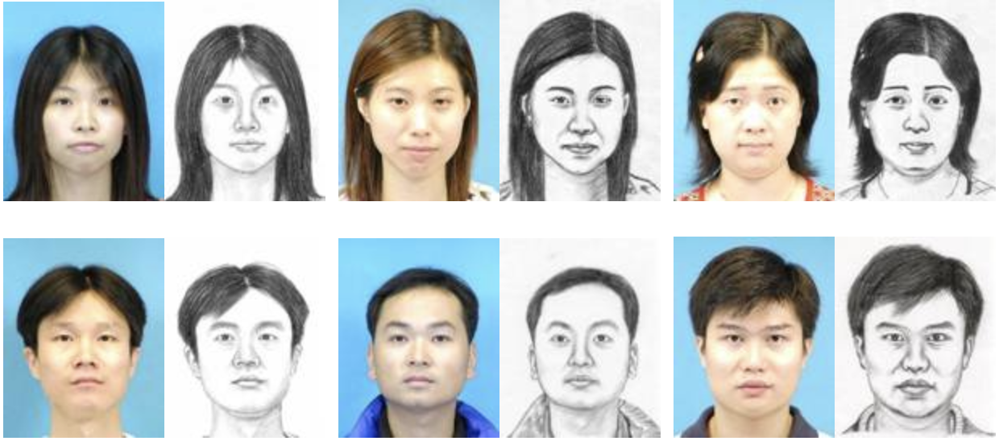

# GANdalf

This repository contains the results of experiments done on a face sketch dataset as an extension to [this repository](https://github.com/sungnam0/Face-Aging-with-CycleGAN).

## Objective

The objective of this project was to use a CycleGAN to convert sketches of people to realistic photos of what the person looks like.

The following conclusions were drawn while working on this project:

1. The quality of the generated images doesn't only depend on the network, but on the quality of the sketches of the person that are used for training. If the sketches do not have a high fidelity then the generated images look like a different human being. In this case, increasing the performance of a network just makes it generated images of a different human being more accurately.
2. There is no quantitative way to measure the performance of two CycleGANs with each other. The judgement in quality was done using visual inspection. Metrics like the Inception Score would just evaluate how realistic the output of the network is, and not if it is a faithful reconstruction of the person's image from a sketch.
3. The network was much better at generating sketches from photos than generating photos from sketches. This could be because sketches have lesser detail and it was easier for the network to learn a compression function converts the detail in a photo to the detail in a sketch.
4. The changes made to create the modified network increase the number of parameters by around **400,000** but reduced the training time by around **7** seconds. The increase in parameters was mainly in the generator networks.

## Dataset

The [CUHK Face Sketch Database (CUFS)](http://mmlab.ie.cuhk.edu.hk/archive/facesketch.html) was used for this project. In particular, the CUHK student dataset was used which contains 88 images in the training set. 80% of these images were used to train the network, and 20% of the images were used to qualitatively judge the quality of the GAN.

The cropped sketches and cropped photos from the dataset were scaled to a resolution of `256x256` and used as images from the two domains that a CycleGAN operates on.

Since the dataset consists of people of the Asian ethnicity, the network might not do well when given a sketch of people of another ethnicity. It would be interesting to see how the network performs when trained on sketches and photos of people of different ethnicities.

## Improvements

The following changes were made to the network to improve its performance on the given dataset.

1. Patch GAN size
   The base network uses a patch of resolution `16x16` as the output of the discriminator for input images of resolution `128x128`. The patch is more effective in specifying whether different parts of the image are real or fake. This is an improvement over a single value between 0 and 1 that specifies whether the entire image is real or fake.
   In this project, the size of the patch was increased to `32x32` to compensate for the increase in input image resolution to `256x256`.
2. Generator architecture
   The base network used a UNet as a generator. This project retains the overall structure of a UNet, but makes the following changes:
   - The kernel shape was changed to `3x3` to allow for faster computation and focus on finer features.
   - The stride of the convolutions is removed, and instead `Max Pooling` layers are added in the encoder part of the network to reduce the dimension of the image.
   - In the deconvolution part of the network, multiple convolutional layers are used to allow the network to assemble more precise output.
3. Discriminator architecture
   The discriminators used in the base network are regular convolutional networks that take an image of size `256x256` as the input and give a patch of a specified size as the output with a single filter. The average of all these values is considered to compute whether the network considers the image a real image or a fake one. The discriminator starts with 32 filters in the first layer, and the number of filters increases by powers of 2 for four blocks.
   The following changes were made in the architecture of the discriminator:
   - The kernel shape was changed to `3x3` to allow for faster computation.
   - Strided convolutions were replaced with convolutions of stride 1 and `Max Pooling` layers to reduce the dimensions of the image.

The following parts of the network remain the same as the original network:

1. Training regime
   The network is trained on batches of a single image. For each image, the discriminators are first trained, and then the generators are trained with the weights of the discriminators frozen.
   The final evaluation on the test set is done with the weights that have the lowest cyclic loss during training.
2. Optimizer
   Adam optimizer is used with a learning rate of `0.0002` and a beta_1 value of `0.5`. The remaining parameters keep their default values as specifed in [Keras](https://keras.io/optimizers/).

## Comparisons

| Parameter                      | Original Network                                             | Modified Network                                             |
| ------------------------------ | ------------------------------------------------------------ | ------------------------------------------------------------ |
| Number of trainable parameters | **3,104,594** (1,545,425 [Generator] + 1,559,169 [Discriminator]) | **3,503,320** (1,947,729 [Generator] + 1,555,591 [Discriminator]) |
| Time to train per epoch        | **47** seconds                                               | **40** seconds                                               |

*Both networks were trained for 50 epochs.*

### Sketch to Image network

Photos generated by the network from sketches in the test set.

- First column: input sketch
- Second column: generated photo using base network
- Third column: generate photo using modified network
- Fourth column: actual photo (ground truth)

#### Cycle-consistency (sketch -> image -> sketch)

- First three columns: base network
- Last three columns: modified network

### Image to Sketch network

Sketches generated by the network from photos in the test set.

- First column: input photo
- Second column: generated sketch using base network
- Third column: generated sketch using modified network
- Fourth column: actual sketch (ground truth)

#### Cycle-consistency (image -> sketch -> image)

- First three columns: base network
- Last three columns: modified network

